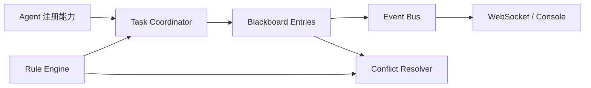

# 核心概念

## Agent

智能体通过名称和能力集合注册。协调器在自动分配时综合任务所需能力和当前负载选择候选者；
心跳机制用于识别在线状态。

## Blackboard Entry

条目是可共享的结构化知识，包含主题、内容、标签、优先级和置信度。更新使用版本号实现乐观锁，
过期写入会得到 `409 Conflict`，避免静默覆盖其他智能体的工作。

## Task

任务声明能力要求、优先级、依赖和状态。依赖完成后可自动解锁并分配；循环依赖会在创建时被拒绝。

## Conflict

系统支持写入冲突、意见冲突和分配冲突。解决策略包括合并、优先级、投票和升级，且已解决的冲突
受到终态保护，不能被重复处理。

## Rule

规则把事件、条件和动作连接起来。它可在运行时更新，适合表达“高优先级任务优先分配”之类的
协作政策，而不必改动协调器核心代码。
